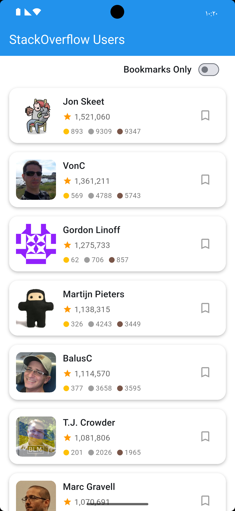
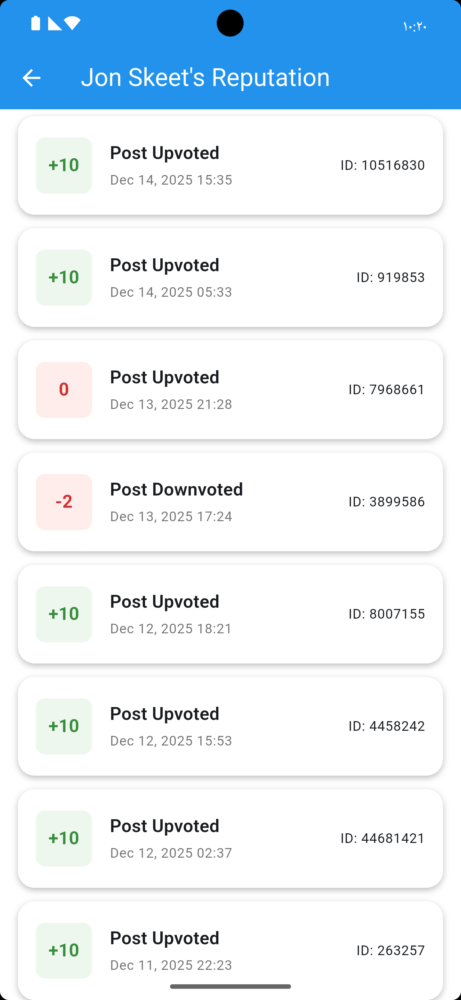

# StackOverflow Users Flutter App

A complete Flutter application built with **MVVM architecture + Cubit** for browsing StackOverflow users and their reputation history.

## 🏗️ Architecture

This project follows **MVVM (Model-View-ViewModel)** architecture with **Cubit** for state management:

```
lib/
├── core/
|   ├── di                                # Dependency Injection
│   ├── network/
|   |   ├── error/                        # API error handling
|   |   |   ├── api_failure.dart          # API failure handling
|   |   |   └── response_codes.dart       # API response codes
│   │   ├── dio_client.dart               # Singleton Dio HTTP client
│   │   └── endpoints.dart                # API endpoints configuration
│   └── services/
│   |   └── storage_service.dart          # Local storage service
│   └── storage/
│       └── shared_pref_utils.dart        # SharedPreferences wrapper
│   └── widgets/                          # Reusable widgets
├── features/
│   ├── users/
│   │   ├── model/
│   │   │   ├── user_model.dart           # User data model
│   │   │   └── user_model.g.dart         # Generated JSON serialization
│   │   ├── respository/
│   │   │   └── users_repository.dart     # Users repository interface
│   │   ├── view/
│   │   │   ├── users_screen.dart         # Users screen
│   │   │   └── widgets/
│   │   │       └── user_item.dart        # User list item widget
│   │   └── view_model/
│   │       ├── users_cubit.dart          # Business logic & state management
│   │       └── users_state.dart          # State definitions
│   └── reputation/
│       ├── model/
│       │   ├── reputation_model.dart     # Reputation data model
│       │   └── reputation_model.g.dart
│       ├── repository/
│       │   └── reputation_repository.dart # Reputation repository interface
│       ├── view/
│       │   └── reputation_screen.dart    # Reputation screen
│       └── view_model/
│           ├── reputation_cubit.dart     # Business logic & state management
│           └── reputation_state.dart     # State definitions
├── app.dart                              # Root app widget with theme
└── main.dart                             # Entry point
```

## UI Screenshots
| Users Screen | Reputation Screen |
|--------------|-------------------|
|  |  |

## ✨ Features

### 1. **StackOverflow Users List**
- ✅ Load all StackOverflow users with **infinite scroll pagination**
- ✅ Display user profile image, name, reputation, and badges
- ✅ **Bookmark/unbookmark** users with persistent storage
- ✅ **Filter to show only bookmarked users**
- ✅ **Pull-to-refresh** functionality
- ✅ Smooth scrolling optimized for large lists (10,000+ items)
- ✅ Clean UI with separated, reusable widgets

### 2. **User Reputation History**
- ✅ View detailed reputation history for any user
- ✅ Display reputation type, change amount, and date
- ✅ **Infinite scroll** for reputation entries
- ✅ Color-coded positive/negative reputation changes
- ✅ Formatted dates and readable reputation types

## 🛠️ Technologies & Packages

| Package | Purpose |
|---------|---------|
| `flutter_bloc` | State management with Cubit |
| `equatable` | Value equality for state classes |
| `dio` | HTTP networking |
| `shared_preferences` | Local data persistence |
| `json_annotation` | JSON serialization annotations |
| `json_serializable` | Code generation for JSON |
| `build_runner` | Code generation runner |
| `intl` | Date formatting |
| `cached_network_image` | Efficient image loading & caching |

## 🚀 Getting Started

### Prerequisites
- Flutter SDK 3.10.0 or higher
- Dart SDK 3.10.0 or higher

### Installation

1. **Clone the repository** (or navigate to the project directory)

2. **Install dependencies:**
   ```bash
   flutter pub get
   ```

3. **Generate JSON serialization code:**
   ```bash
   flutter pub run build_runner build --delete-conflicting-outputs
   ```

4. **Run the app:**
   ```bash
   flutter run
   ```

## 📱 How to Use

### Users Screen
1. **Scroll** through the list to load more users automatically
2. **Tap the bookmark icon** to save/unsave users
3. **Tap the filter icon** in the app bar to show only bookmarked users
4. **Pull down** to refresh the user list
5. **Tap on any user** to view their reputation history

### Reputation Screen
1. View reputation changes with color-coded indicators (green = positive, red = negative)
2. Scroll to load more reputation history
3. Pull down to refresh

## 🎨 UI Features

- **Modern Material Design 3** theme
- **Circular avatars** with fallback initials
- **Badge display** (gold, silver, bronze)
- **Formatted reputation** with comma separators
- **Smooth animations** and transitions
- **Error handling** with user-friendly messages
- **Loading states** for better UX

## 🔧 Key Implementation Details

### State Management
- **Cubit** pattern for predictable state management
- Separate states for loading, success, error, and loading more
- Immutable state classes using Equatable

### Networking
- Singleton `DioClient` with interceptors for logging
- Centralized endpoint configuration
- Comprehensive error handling for API rate limits

### Local Storage
- Singleton `LocalStorage` wrapper for SharedPreferences
- JSON serialization for bookmark persistence
- Automatic loading of bookmarks on app start

### Pagination
- Efficient infinite scroll implementation
- Separate loading states for initial load vs. pagination
- Automatic page tracking

## 📊 API Endpoints

**Users List:**
```
GET https://api.stackexchange.com/2.2/users?page={page}&pagesize=30&site=stackoverflow
```

**User Reputation:**
```
GET https://api.stackexchange.com/2.2/users/{userId}/reputation-history?page={page}&pagesize=30&site=stackoverflow
```

## 🎯 Code Quality

- ✅ **No lint errors** - All code passes `flutter analyze`
- ✅ **Production-ready** - Uses `debugPrint` instead of `print`
- ✅ **Well-documented** - Comprehensive comments throughout
- ✅ **Type-safe** - Full type annotations
- ✅ **Testable** - Unit tests for core functionality
- ✅ **Clean architecture** - Clear separation of concerns

## 📝 Notes

- The app handles API rate limiting gracefully with user-friendly error messages
- Bookmarks persist across app restarts using SharedPreferences
- The infinite scroll is optimized to trigger at 90% scroll position
- All network requests include proper timeout configurations
- Images are cached for better performance
